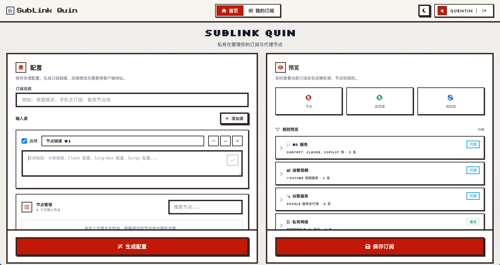
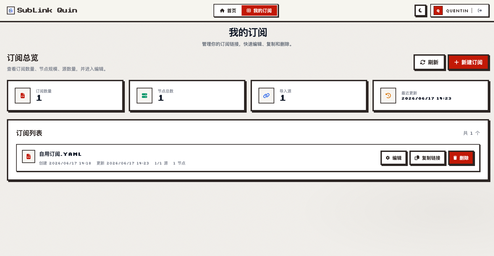

  

  <h1><b>SubLink Quin</b></h1>
  <h5><i>One Worker, All Subscriptions</i></h5>

  
<b>A lightweight subscription converter and manager for proxy protocols, deployable on Cloudflare Workers, Vercel, or Node.js.</b>

  

    <b>English</b> | <a href="README_CN.md"><b>简体中文</b></a>
  

  

   

  
  

## 🖥️ Preview

## 🚀 Quick Start

### One-Click Deployment
- Choose a "deploy" button above to click
- That's it! See the [Document](https://sublink.works/guide/quick-start/) for more information.

### Alternative Runtimes
- **Node.js**: `npm run build:node && node dist/node-server.cjs`
- **Vercel**: `vercel deploy` (configure KV in project settings)

## ✨ Features

### Supported Protocols
ShadowSocks • VMess • VLESS • Hysteria2 • Trojan • TUIC

### Client Support
Sing-Box • Clash • Xray/V2Ray • Surge

### Input Support
- Base64 subscriptions
- HTTP/HTTPS subscriptions
- Full configs (Sing-Box JSON, Clash YAML, Surge INI)

### Core Capabilities
- Import subscriptions from multiple sources
- Generate fixed/random short links (KV-based)
- Light/Dark theme toggle
- Flexible API for script automation
- Multi-language support (Chinese, English, Persian, Russian)
- Web interface with predefined rule sets and customizable policy groups

## 🤝 Contributing

Issues and Pull Requests are welcome to improve this project.

## 🔗 Friendly Links

- [LINUX DO](https://linux.do/)

## 🙏 Acknowledgements

This project is a secondary development (fork) based on the excellent open-source project [7Sageer/sublink-worker](https://github.com/7Sageer/sublink-worker). Sincere thanks to the original author and all contributors for their outstanding work.

## 📄 License

This project is licensed under the MIT License - see the [LICENSE](LICENSE) file for details.

## ⚠️ Disclaimer

This project is for learning and exchange purposes only. Please do not use it for illegal purposes. All consequences resulting from the use of this project are solely the responsibility of the user and are not related to the developer.

## ⭐ Star History

Thanks to everyone who has starred this project! 🌟

<a href="https://star-history.com/#quin95/sublink-worker&Date">
 <picture>
   <source media="(prefers-color-scheme: dark)" srcset="https://api.star-history.com/svg?repos=quin95/sublink-worker&type=Date&theme=dark" />
   <source media="(prefers-color-scheme: light)" srcset="https://api.star-history.com/svg?repos=quin95/sublink-worker&type=Date" />
   
 </picture>
</a>
